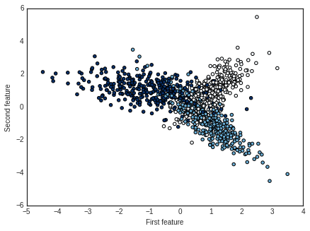
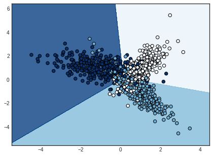

```python
# Import useful libraries
from sklearn.datasets import make_classification 
import matplotlib.pyplot as plt
import numpy as np

# Show plots inline
%matplotlib inline 
plt.rcParams['figure.figsize'] = (7,5)

# Generate toy dataset for classification
# X is a matrix of n_samples x n_features and represents the input features
# y is a vector with length n_samples and represents our target 
X, y = make_classification(n_samples=1000, n_features=2, n_redundant=0, 
                           random_state=2016, n_clusters_per_class=1,
                           n_classes=3)

# Visualize generated dataset
plt.style.use('seaborn-white') # change default style of plot
plt.scatter(X[:,0], X[:,1], c=y, cmap=plt.cm.Blues)
plt.xlabel('First feature')
plt.ylabel('Second feature')
plt.show()
```





```python
# Getting some useful parameters
n_features = X.shape[1] # number of features 
n_samples = X.shape[0] # number of samples
n_classes = len(np.unique(y)) # number of classes in the dataset

# Initialize weights randomly from a Gaussian distribution
std = 1e-3 # standard deviation of the normal distribution 
W = np.random.normal(loc=0.0, scale=std, size=(n_features, n_classes))

# Initialize biases with 0
b = np.zeros(n_classes)

# Linear mapping scores
scores = np.dot(X,W)+b

# Exponential scores
# Normalize the scores beforehand with max as zero to avoid 
# numerical problems with the exponential
exp_scores = np.exp(scores - np.max(scores, axis=1, keepdims=True))

# Softmax activation
probs = exp_scores/np.sum(exp_scores, axis=1, keepdims=True)

# Log loss of the correct class of each of our samples
correct_logprobs = -np.log(probs[np.arange(n_samples), y])

# Compute the average loss
loss = np.sum(correct_logprobs)/n_samples

# Add regularization using the L2 norm
# reg is a hyperparameter and controls the strength of regularization
reg = 0.5
reg_loss = 0.5*reg*np.sum(W*W)
loss += reg_loss

# Gradient of the loss with respect to scores
dscores = probs.copy()

# Substract 1 from the scores of the correct class
dscores[np.arange(n_samples),y] -= 1

# Instead of dividing both dW and db with the number of
# samples it's easier to divide dscores beforehand
dscores /= n_samples

# Gradient of the loss with respect to weights
dW = X.T.dot(dscores) 

# Add gradient regularization 
dW += reg*W

# Gradient of the loss with respect to biases
db = np.sum(dscores, axis=0, keepdims=True)
```


```python
# Create a class for the Softmax linear classifier
class Softmax(object):    

  def __init__(self):
    self.W = None
    self.b = None
    
  def get_loss_grads(self, X, y, reg, n_features, n_samples, n_classes):
      
    # Linear mapping scores
    scores = np.dot(X, self.W)+self.b

    # Normalize the scores beforehand with max as zero to avoid 
    # computational problems with the exponential
    exp_scores = np.exp(scores - np.max(scores, axis=1, keepdims=True))

    # Softmax activation
    probs = exp_scores/np.sum(exp_scores, axis=1, keepdims=True)

    # Logloss of the correct class for each of our samples
    correct_logprobs = -np.log(probs[np.arange(n_samples), y])

    # Compute the average loss
    loss = np.sum(correct_logprobs)/n_samples

    # Add regularization using the L2 norm
    reg_loss = 0.5*reg*np.sum(self.W*self.W)
    loss += reg_loss
    
    # Gradient of the loss with respect to scores
    dscores = probs.copy()

    # Substract 1 from the scores of the correct class
    dscores[np.arange(n_samples),y] -= 1
    dscores /= n_samples

    # Gradient of the loss with respect to weights
    dW = X.T.dot(dscores) 

    # Add gradient regularization 
    dW += reg*self.W

    # Gradient of the loss with respect to biases
    db = np.sum(dscores, axis=0, keepdims=True)

    return loss, dW, db


  def train(self, X, y, learning_rate=1e-4, reg=0.5, num_iters=500):
       
    # Get useful parameters
    n_features, n_samples = X.shape[1], X.shape[0]   
    n_classes = len(np.unique(y))
    
    # Initialize weights from a normal distribution and the biases with zeros
    if (self.W is None) & (self.b is None):
      np.random.seed(2016) # for reproducible results
      self.W = np.random.normal(loc=0.0, scale=1e-4, size=(n_features, n_classes))
      self.b = np.zeros((1, n_classes))
        
    for iter in range(num_iters):
      # Get loss and gradients
      loss, dW, db = self.get_loss_grads(X, y, reg, n_features, n_samples, n_classes)
      
      # update weights and biases
      self.W -= learning_rate*dW
      self.b -= learning_rate*db
        
        
  def train_early_stopping(self, X_train, y_train, X_val, y_val, learning_rate=1e-4, reg=0.5, 
                           early_stopping_rounds=200):
       
    # Get useful parameters_train
    n_features, n_samples = X_train.shape[1], X_train.shape[0]   
    n_classes = len(np.unique(y))
    
    # Initialize weights from a normal distribution and the biases with zeros
    if (self.W is None) & (self.b is None):
      np.random.seed(2016) # for reproducible results
      self.W = np.random.normal(loc=0.0, scale=1e-4, size=(n_features, n_classes))
      self.b = np.zeros((1, n_classes))
    
    # Stores best accuracy found 
    best_val_accuracy = -1
    
    # Stores the weights and biases of the best iteration
    best_weights, best_bias = None, None
    
    # Counts the number of no improvements in the accuracy
    no_improvement = 0
    
    # Boolean variable which helps us get out of the while loop
    keep_training = True
        
    while keep_training:
        
      # Get loss and gradients
      loss, dW, db = self.get_loss_grads(X_train, y_train, reg, n_features, n_samples, n_classes)
    
      # update weights and biases
      self.W -= learning_rate*dW
      self.b -= learning_rate*db
              
      # Compute validation accuracy
      val_accuracy = np.mean(self.predict(X_val)==y_val)
        
      if val_accuracy>best_val_accuracy:
        best_val_accuracy = val_accuracy
        best_weights, best_bias = self.W, self.b
        # reset count
        no_improvement = 0
      else:
        no_improvement += 1
        
      if no_improvement == early_stopping_rounds:
        self.W, self.b = best_weights, best_bias
        keep_training = False
      
      
  def predict(self, X):
    
    y_pred = np.dot(X, self.W)+self.b
    y_pred=np.argmax(y_pred, axis=1)
    
    return y_pred
       
```


```python
# Split dataset into training and validation
X_train, y_train = X[0:800], y[0:800]
X_val, y_val = X[800:], y[800:]

# Train with early stopping
softmax = Softmax()
softmax.train_early_stopping( X_train, y_train, X_val, y_val, 
                             learning_rate=1e-2, reg=0.1, 
                             early_stopping_rounds=300)
print('Training accuracy',np.mean(softmax.predict(X_train)==y_train))
print('Validation accuracy',np.mean(softmax.predict(X_val)==y_val))
```

    Training accuracy 0.815
    Validation accuracy 0.805


```python
# Train on the entire dataset
softmax = Softmax()
softmax.train(X, y, learning_rate=1e-2, reg=0.1, num_iters=1000)
print('Training accuracy', np.mean(softmax.predict(X)==y))
```

    Training accuracy 0.816


```python
# Create a mesh to plot in
x_min, x_max = X[:, 0].min() - 1, X[:, 0].max() + 1
y_min, y_max = X[:, 1].min() - 1, X[:, 1].max() + 1
xx, yy = np.meshgrid(np.arange(x_min, x_max, 0.01),
                     np.arange(y_min, y_max, 0.01))

# Predict target for each sample xx, yy
Z = softmax.predict(np.c_[xx.ravel(), yy.ravel()])

# Put the result into a color plot
Z = Z.reshape(xx.shape)
fig = plt.figure()
plt.contourf(xx, yy, Z, cmap=plt.cm.Blues, alpha=0.8)

# Plot our training points
plt.scatter(X[:, 0], X[:, 1], c=y, s=40, cmap=plt.cm.Blues)
plt.xlim(xx.min(), xx.max())
plt.ylim(yy.min(), yy.max())
plt.show()
```





```python

```
